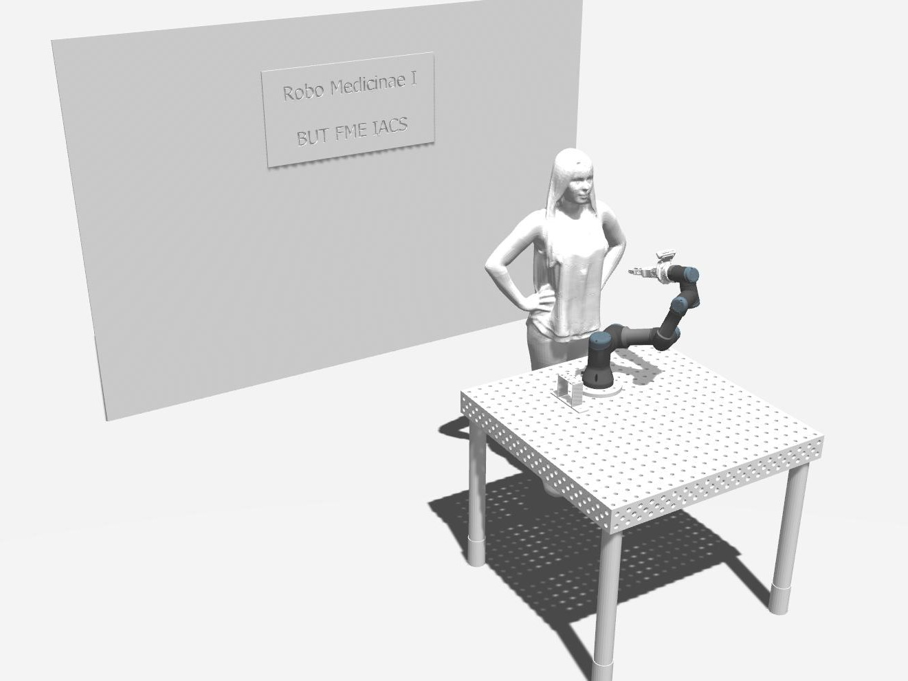
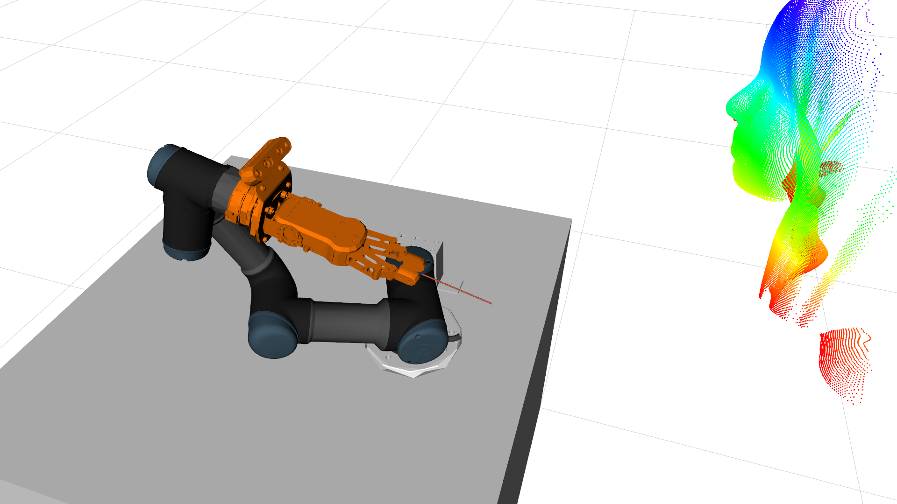
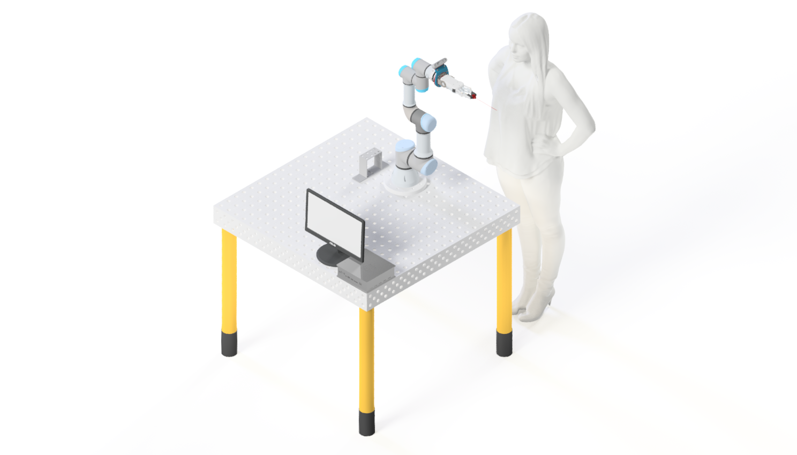

<p align="center">
  
</p>

***

# RoboMedicinae1 - ROS
<a href="https://github.com/Steigner/RM1_ROS/blob/main/LICENSE"></a>
[](https://github.com/psf/black)

**Open-source, copy and modify what you need!**

**Open-source, kopírujte a upravujte co potřebujete!**

## About
RM1 is an experimental robotic platform created to automate antigen testing. This project was developed as part of a master's thesis. The aim was to create a functional and modular prototype that is easily modifiable and deployable after debugging. The basic idea is to create a web-based server that communicates with ROS. ROS was used in the work as a simulation and debugging environment, mainly for robot control. The thesis is divided into four main parts:

+ [<=](https://github.com/Steigner/RM1_server) RM1 - Server
+ [<=](https://github.com/Steigner/RM1_ROS) RM1 - ROS         
+ [<=](https://github.com/Steigner/RM1_Gripper) RM1 - Gripper
+ [<=](https://github.com/Steigner/RM1_SegCNN) RM1 - SegCNN

I decided to go with a solution where ROS will not be included in Docker for development and simulation. ROS was used as an enabler for simulation and subsequent real world testing. It also made access and updates within development easier. But the resulting real world deploy includes the ability to whitelist ROS Docker into the App, or possibly extracting the simulated robot paths into e.g. the **python-urx library** and with added facilities.

**Robot, gripper and sensors**

| Part                       | Type                        |
| -------------------------- | --------------------------- |
| Robot                      | Universal Robots UR3        |
| 3D Camera                  | Intel Realsense D435i       |
| 2-finger Gripper           | Onrobot RG2                 |
| Force-Torque Sensor        | Onrobot Hex-e               |

**Robot control**

| Part                       | Type                        |
| -------------------------- | --------------------------- |
| Control framework          | ROS Melodic                 |
| Prog. lang.                | Python 2                    |

## Note
**! Attention !** the problem occurred in rosbridge, which showed an error, for full functionality and unslowed communication it is necessary to make a modification in the file: 
```console
/opt/ros/<rosdistro>/share/rosbridge_server/launch/rosbridge_websocket.launch
```
Change "unregister_timeout" [[#138](https://github.com/RobotWebTools/rosbridge_suite/issues/138)]. Example is in file [rosbridge_websocket.launch](https://github.com/Steigner/RM1_ROS/blob/main/rosbridge_websocket.launch).

usefull to run Nautilus file manager with sudo:
```console
user@user-pc:~$ sudo nautilus
```

## ROS
This application was tested mainly on **ROS Melodic Morenia**, but there is option to use in another distors, but samoe scripts must be changed.
For run there need to be involved some dependencies to **catkin workspace**, but first install ROS.
```console
<rosdistro> = kinetic, melodic, noetic ...
```

* ROS Melodic Morenia [=>](http://wiki.ros.org/melodic/Installation)
```console
user@user-pc:~$ sudo apt-get install ros-<rosdistro>-desktop-full
```

* Moveit [=>](https://moveit.ros.org/install/)
```console
user@user-pc:~$ sudo apt-get install ros-<rosdistro>-moveit
```

* Rosbridge [=>](http://wiki.ros.org/rosbridge_suite)
```console
user@user-pc:~$ sudo apt-get install ros-<rosdistro>-rosbridge-server
```

* TF2-Web-Republisher [=>](http://wiki.ros.org/tf2_web_republisher)
```console
user@user-pc:~$ sudo apt-get install ros-<rosdistro>-tf2-web-republisher
```
After you create a catkin workspace, you must imply the following packages:

* Universal Robots ROS Driver [=>](https://github.com/UniversalRobots/Universal_Robots_ROS_Driver) 

```bash
# source global ros
$ source /opt/ros/<your_ros_version>/setup.bash

# create a catkin workspace
$ mkdir -p catkin_ws/src && cd catkin_ws

# clone the driver
$ git clone https://github.com/UniversalRobots/Universal_Robots_ROS_Driver.git src/Universal_Robots_ROS_Driver

# clone fork of the description. This is currently necessary, until the changes are merged upstream.
$ git clone -b calibration_devel https://github.com/fmauch/universal_robot.git src/fmauch_universal_robot

# install dependencies
$ sudo apt update -qq
$ rosdep update
$ rosdep install --from-paths src --ignore-src -y

# build the workspace
$ catkin_make

# activate the workspace (ie: source it)
$ source devel/setup.bash
```
<p align="center">
<a href="https://github.com/Steigner/RM1_ROS/blob/main/LICENSE">https://github.com/UniversalRobots/Universal_Robots_ROS_Driver#building</a>
</p>

* RM1_ROS [=>](https://github.com/Steigner/RM1_ROS)
```console
user@user-pc:~$ git clone https://github.com/Steigner/RM1_ROS.git
```
Note: This package **robo_medicinae** should be on the same file system level as **Universal_Robots_ROS_Driver** and **universal_robot** from fmauch.

* Optoforce [=>](https://github.com/shadow-robot/optoforce)
```console
user@user-pc:~$ git clone https://github.com/shadow-robot/optoforce.git
```
Note: This package **optoforce** should be on the same file system level as **Universal_Robots_ROS_Driver** and **universal_robot** from fmauch. USB communication was used for data acquisition. This is for real world testing.

## Hierarchy in catkin workaspace
**Simulation**
```
src
│   CMakeLists.txt  
└───robo_medicinae
└───universal_robot
└───Universal_Robots_ROS_Driver
```

**Real world optionaly with Hex-e sensor**
```
src
│   CMakeLists.txt 
└───optoforce
└───robo_medicinae
└───universal_robot
└───Universal_Robots_ROS_Driver
```

## Run
One bash script from the RM1_Server repository is implemented within the whole application. However, everything can be run in individual terminals:
But don't forget that you must also have the **RM1_Server** repository for proper functionality!!! This is just a guide on how to run each part.

**Gazebo sim**
```console
user@user-pc:~$ roslaunch robo_platform ur3_bringup.launch
```

**ROS real-world / ursim controller**
```console
user@user-pc:~$ roslaunch robo_platform ur3_driver_bringup.launch robot_ip:=127.0.0.1
user@user-pc:~$ roslaunch robo_platform ur3_driver_bringup.launch robot_ip:=xxx.xxx.xxx.xxx
```

**Moveit sim**
```console
user@user-pc:~$ roslaunch robo_moveit ur3_moveit_planning_execution.launch sim:=true
```

**Moveit real-world / ursim**
```console
user@user-pc:~$ roslaunch robo_moveit ur3_moveit_planning_execution.launch
```

**ROS Rviz**
```console
user@user-pc:~$ roslaunch robo_moveit moveit_rviz_new.launch config:=true
```

**ROS Bridge**
```console
user@user-pc:~$ roslaunch rosbridge_server rosbridge_websocket.launch
```

**Tf2 Web republisher**
```console
user@user-pc:~$ rosrun tf2_web_republisher tf2_web_republisher
```

**HEX-e sensor publisher**
```console
user@user-pc:~$ roslaunch optoforce optoforce.launch
```
Note: before run ensure that: 

```console
user@user-pc:~$ sudo chmod a+rw /dev/ttyACM0
```

**Python switch**
```console
user@user-pc:~$ rosrun robo_control switch.py
```

**Python init motion**
```console
user@user-pc:~$ rosrun robo_control motion_robot.py 1
```

Note: Script **switch.py** was programmed as main script for control other function and communicate with client. To run the simulation follow:

* Gazebo
* Moveit
* Additionaly Rviz
* Rosbridge
* Additionaly TF2 for control_robot page
* Python switch 

Another simulation option is to use ursim [=>](https://www.universal-robots.com/download)

## Images

<p align="center"> <b>Click to full resolution</b> </p>

<p align="center">




</p>

## Authors

* Author: Martin Juricek
* Supervisor: Roman Parak

## References

[Faculty of Mechanical Engineering BUT](https://www.fme.vutbr.cz/en)
